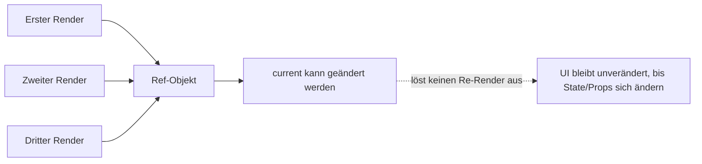

###### Themen

useRef: Referenzen und Persistenz

- Was ist `useRef`?
- DOM-Referenzen mit `useRef` verwenden
- Fokus auf ein Input-Feld setzen

useRef in der Praxis

- Werte speichern, ohne Re-Render auszulösen
- Unterschied zwischen `useRef` und State
- Typische Anwendungsfälle für `useRef`

# 🧷 `useRef`: Referenzen und Persistenz

`useRef` ist ein React-Hook, mit dem du dir einen **stabilen Speicherplatz über mehrere Render-Durchläufe hinweg** anlegen kannst. Dieser Speicherplatz ist ein Objekt mit genau einer wichtigen Eigenschaft: `current`. React gibt dir bei jedem Render **dasselbe Ref-Objekt** zurück, und genau darin liegt die Stärke von `useRef`: Der Wert bleibt erhalten, ohne dass seine Änderung automatisch ein neues Rendern auslöst ([useRef – React](https://react.dev/reference/react/useRef)).

Du kannst dir `useRef` wie eine kleine Box vorstellen, die React für deine Komponente aufbewahrt. In diese Box kannst du etwas hineinlegen, später wieder auslesen und auch verändern. Im Unterschied zu State sagt React aber nicht: „Ah, hier hat sich etwas geändert, ich muss die Oberfläche neu zeichnen.“ Deshalb ist `useRef` ideal für Dinge, die **gemerkt** werden müssen, aber **nicht direkt dargestellt** werden.




<br><br><br>
## 🔍 Was ist `useRef`?

Die Grundidee von `useRef` ist einfach:

```jsx
import { useRef } from 'react';

function Beispiel() {
  const meineRef = useRef(0);

  return <button>Hallo</button>;
}
```

`useRef(0)` erzeugt ein Objekt ungefähr in dieser Form:

```js
{
  current: 0
}
```

Wichtig ist dabei:

- Der Startwert, den du an `useRef(...)` übergibst, wird nur für den **ersten Render** verwendet.
- Danach bleibt das Ref-Objekt bestehen.
- Wenn du `meineRef.current` änderst, rendert React **nicht** neu ([useRef – React](https://react.dev/reference/react/useRef)).

Ein einfaches Beispiel:

```jsx
import { useRef } from 'react';

function KlickZaehlerOhneRender() {
  const countRef = useRef(0);

  function handleClick() {
    countRef.current += 1;
    console.log('Aktueller Wert:', countRef.current);
  }

  return <button onClick={handleClick}>Klick mich</button>;
}
```

Hier passiert Folgendes: Bei jedem Klick wird `countRef.current` erhöht. Der neue Wert wird in der Konsole sichtbar, aber die Komponente rendert nicht neu. Das zeigt schon sehr gut, wofür `useRef` gedacht ist: **interne, veränderbare Werte**, die du zwischen Rendern behalten willst.

Der wichtigste Merksatz lautet:

**State ist für Werte, die die Oberfläche beeinflussen.  
Ref ist für Werte, die du behalten musst, ohne die Oberfläche neu zu rendern.**

Ein weiterer wichtiger Punkt: `useRef` wird sehr oft für **DOM-Elemente** verwendet, zum Beispiel für ein `<input>`, auf das du zugreifen willst. Es kann aber genauso gut für normale JavaScript-Werte genutzt werden, etwa für Timer-IDs, vorherige Werte, externe Instanzen oder andere „merke dir das bitte“-Daten ([useRef – React](https://react.dev/reference/react/useRef)).

React empfiehlt außerdem, `ref.current` normalerweise **nicht während des Renderns** beliebig zu lesen oder zu schreiben, weil Rendern in React möglichst rein und vorhersagbar bleiben soll. Typische Zugriffe auf Refs passieren stattdessen in **Event-Handlern** oder in **Effects** ([useRef – React](https://react.dev/reference/react/useRef)).


<br><br><br>
## 🧱 DOM-Referenzen mit `useRef` verwenden

Eine der häufigsten Anwendungen von `useRef` ist der Zugriff auf echte DOM-Elemente. Du kannst also zum Beispiel ein `<input>`, ein `<div>` oder ein `<video>` direkt referenzieren.

Das Grundmuster sieht so aus:

```jsx
import { useRef } from 'react';

function Formular() {
  const inputRef = useRef(null);

  return <input ref={inputRef} type="text" />;
}
```

Hier passiert im Hintergrund Folgendes:

1. Du erzeugst mit `useRef(null)` ein Ref-Objekt.
2. Du gibst dieses Objekt über das Attribut `ref={inputRef}` an ein DOM-Element weiter.
3. Nachdem das Element in den DOM eingefügt wurde, setzt React `inputRef.current` auf den echten DOM-Knoten.
4. Wenn das Element wieder entfernt wird, setzt React `inputRef.current` zurück auf `null` ([Manipulating the DOM with Refs – React](https://react.dev/learn/manipulating-the-dom-with-refs)).

Das ist sehr praktisch, wenn du Dinge machen willst, die deklarativ über JSX allein nicht gut lösbar sind, zum Beispiel:

- Fokus setzen
- scrollen
- Text markieren
- Größen messen
- Medien steuern
- externe Bibliotheken an DOM-Elemente andocken

Ein kleines Beispiel zum Nachschauen:

```jsx
import { useRef } from 'react';

function Beispiel() {
  const inputRef = useRef(null);

  function handleClick() {
    console.log(inputRef.current);
  }

  return (
    <>
      <input ref={inputRef} type="text" />
      <button onClick={handleClick}>DOM-Knoten anzeigen</button>
    </>
  );
}
```

Wenn du auf den Button klickst, bekommst du das echte DOM-Element in der Konsole zu sehen. Das ist kein „React-Abbild“, sondern wirklich das zugrunde liegende HTML-Element.

Wichtig ist aber auch die Einordnung: React will normalerweise, dass du die Benutzeroberfläche **deklarativ** beschreibst. Das bedeutet: Wenn etwas über State und Props lösbar ist, solltest du das bevorzugen. `useRef` für DOM-Zugriffe ist eher dann richtig, wenn du **direkt und gezielt** auf ein DOM-Element zugreifen musst ([Manipulating the DOM with Refs – React](https://react.dev/learn/manipulating-the-dom-with-refs)).

Im React-19-Kontext ist außerdem nützlich zu wissen: Bei eigenen Komponenten ist `ref` in React 19 als Prop verfügbar, was die Weitergabe von Referenzen vereinfacht ([useImperativeHandle – React](https://react.dev/reference/react/useImperativeHandle)). Für normale DOM-Elemente wie `<input>` oder `<div>` bleibt das Grundprinzip aber genau so, wie du es oben siehst.


<br><br><br>
## 🎯 Fokus auf ein Input-Feld setzen

Ein sehr typischer Anwendungsfall ist das Setzen des Fokus auf ein Eingabefeld. Das ist zum Beispiel nützlich bei Suchfeldern, Login-Formularen oder nach einem Klick auf einen Button.

Das grundlegende Beispiel:

```jsx
import { useRef } from 'react';

function Suche() {
  const inputRef = useRef(null);

  function handleFocus() {
    inputRef.current?.focus();
  }

  return (
    <>
      <input ref={inputRef} type="text" placeholder="Suche..." />
      <button onClick={handleFocus}>Fokus setzen</button>
    </>
  );
}
```

Hier ist `inputRef.current` das echte DOM-`input`-Element. Darauf rufst du die DOM-Methode `focus()` auf. Diese Methode setzt den Tastaturfokus auf das Element, sodass der Benutzer direkt losschreiben kann ([HTMLElement: focus() method – MDN Web Docs](https://developer.mozilla.org/en-US/docs/Web/API/HTMLElement/focus)).

Das `?.` in `inputRef.current?.focus()` ist eine Sicherheitsmaßnahme. Es bedeutet: „Rufe `focus()` nur auf, wenn `current` nicht `null` ist.“ Das ist sinnvoll, weil ein Ref zu bestimmten Zeitpunkten noch leer sein kann, etwa bevor das Element gemountet wurde oder nachdem es entfernt wurde.

Wenn der Fokus **automatisch direkt nach dem ersten Anzeigen** gesetzt werden soll, kombinierst du `useRef` oft mit `useEffect`:

```jsx
import { useEffect, useRef } from 'react';

function AutoFokus() {
  const inputRef = useRef(null);

  useEffect(() => {
    inputRef.current?.focus();
  }, []);

  return <input ref={inputRef} type="text" placeholder="Direkt fokussiert" />;
}
```

Warum ist hier `useEffect` passend? Weil der Effekt erst **nach dem Rendern** läuft. Erst dann existiert das DOM-Element zuverlässig, und der Fokus kann gesetzt werden. Das ist das saubere React-Muster für solche DOM-Nachbearbeitung ([Manipulating the DOM with Refs – React](https://react.dev/learn/manipulating-the-dom-with-refs)).

Ein weiteres praktisches Beispiel ist das Fokussieren nach einer Validierung:

```jsx
import { useRef, useState } from 'react';

function LoginForm() {
  const emailRef = useRef(null);
  const [email, setEmail] = useState('');

  function handleSubmit(e) {
    e.preventDefault();

    if (!email.trim()) {
      emailRef.current?.focus();
      return;
    }

    console.log('Formular absenden');
  }

  return (
    <form onSubmit={handleSubmit}>
      <input
        ref={emailRef}
        type="email"
        value={email}
        onChange={(e) => setEmail(e.target.value)}
        placeholder="E-Mail"
      />
      <button type="submit">Senden</button>
    </form>
  );
}
```

Hier zeigt sich gut, wie State und Ref zusammenarbeiten:

- Der sichtbare Wert des Inputs liegt im State, weil er die Oberfläche steuert.
- Die Referenz auf das DOM-Element liegt im Ref, weil sie für direkten Zugriff gedacht ist.

Genau diese Kombination ist in React sehr typisch.


<br><br><br>
# 🛠️ `useRef` in der Praxis

In der Praxis ist `useRef` besonders nützlich, wenn du Werte **dauerhaft innerhalb einer Komponente merken** möchtest, ohne dass jede Änderung eine neue Darstellung auslöst. Das ist eine sehr wichtige Fähigkeit, denn nicht jede Information gehört in den State.

Wenn man `useRef` richtig einsetzt, wird der Code oft sauberer, effizienter und verständlicher: Du trennst dann klar zwischen **sichtbaren Zuständen** und **internen Hilfswerten**.


<br><br><br>
## 💾 Werte speichern, ohne Re-Render auszulösen

Der vielleicht wichtigste praktische Nutzen von `useRef` ist: Du kannst einen Wert speichern, verändern und später wiederverwenden, **ohne** dass React deswegen neu rendert ([useRef – React](https://react.dev/reference/react/useRef)).

Ein klassisches Beispiel ist eine Timer-ID. Stell dir vor, du startest mit `setInterval` einen Timer. Die Rückgabe von `setInterval` brauchst du später, um den Timer wieder zu stoppen. Diese ID soll aber nicht in der Oberfläche angezeigt werden. Genau deshalb ist ein Ref hier passender als State.

```jsx
import { useRef, useState } from 'react';

function Stoppuhr() {
  const intervalRef = useRef(null);
  const [sekunden, setSekunden] = useState(0);

  function start() {
    if (intervalRef.current !== null) return;

    intervalRef.current = setInterval(() => {
      setSekunden((s) => s + 1);
    }, 1000);
  }

  function stop() {
    clearInterval(intervalRef.current);
    intervalRef.current = null;
  }

  return (
    <>
      <p>{sekunden} Sekunden</p>
      <button onClick={start}>Start</button>
      <button onClick={stop}>Stop</button>
    </>
  );
}
```

Warum ist das sinnvoll?

- `sekunden` gehört in den State, weil der Wert in der Oberfläche angezeigt wird.
- `intervalRef.current` gehört ins Ref, weil die Timer-ID nur ein interner technischer Wert ist.

Wenn du die Timer-ID stattdessen in State legen würdest, hättest du unnötige Re-Render, obwohl dieser Wert für das UI gar keine Rolle spielt.

Ein anderes Beispiel ist das Speichern des **vorherigen Wertes** einer Prop oder eines States. Das ist sehr nützlich, wenn du Veränderungen vergleichen möchtest:

```jsx
import { useEffect, useRef } from 'react';

function PreisAnzeige({ preis }) {
  const vorherigerPreisRef = useRef(preis);

  useEffect(() => {
    vorherigerPreisRef.current = preis;
  }, [preis]);

  return (
    <p>
      Vorher: {vorherigerPreisRef.current} € <br />
      Jetzt: {preis} €
    </p>
  );
}
```

Hier merkt sich das Ref den letzten Preiswert. Beim nächsten Render kannst du den aktuellen Wert mit dem vorherigen vergleichen. Das ist ein typischer Fall, in dem `useRef` wie ein internes Gedächtnis funktioniert.

Auch externe Instanzen lassen sich gut in einem Ref speichern, zum Beispiel:

- eine Video-Instanz
- ein Chart-Objekt
- ein Editor
- eine Map-Bibliothek
- ein `AbortController`

Solche Objekte willst du meist zwischen Rendern behalten, aber nicht wegen jeder internen Änderung neu rendern. Auch dafür ist `useRef` gedacht ([useRef – React](https://react.dev/reference/react/useRef)).

Wichtig ist dabei immer: Wenn sich ein Wert ändert und diese Änderung **sichtbar** werden soll, ist `useRef` die falsche Wahl. Dann brauchst du State. Ein Ref ist kein Ersatz für UI-Zustand, sondern ein Werkzeug für **persistente, veränderbare Hilfswerte**.


<br><br><br>
## ⚖️ Unterschied zwischen `useRef` und State

`useRef` und State können beide Werte „behalten“, aber sie erfüllen ganz unterschiedliche Aufgaben.

State ist Reacts offizieller Mechanismus für Daten, die die Ausgabe einer Komponente beeinflussen. Wenn du State änderst, plant React ein neues Rendern ein, damit die Oberfläche aktualisiert werden kann ([State: A Component's Memory – React](https://react.dev/learn/state-a-components-memory)).

Ein Ref dagegen ist eher wie eine private Notizbox der Komponente. Du kannst den Inhalt ändern, aber React behandelt diese Änderung nicht als Grund, die Oberfläche neu zu berechnen ([useRef – React](https://react.dev/reference/react/useRef)).

Die Unterschiede lassen sich sehr gut in einer Tabelle sehen:

| Frage | `useState` | `useRef` |
|---|---|---|
| Bleibt der Wert zwischen Rendern erhalten? | Ja | Ja |
| Führt eine Änderung zu einem Re-Render? | Ja | Nein |
| Ist der Wert für sichtbare UI gedacht? | Ja | Eher nein |
| Kann ich DOM-Elemente referenzieren? | Nein | Ja |
| Typische Inhalte | Formularwerte, aktive Tabs, Ladezustände | DOM-Knoten, Timer-IDs, vorherige Werte, externe Instanzen |
| Wird von React für die Darstellung „beobachtet“? | Ja | Nein |

Ein ganz typischer Fehler ist, mit `useRef` etwas darstellen zu wollen:

```jsx
import { useRef } from 'react';

function FalschesBeispiel() {
  const countRef = useRef(0);

  return (
    <>
      <p>Zähler: {countRef.current}</p>
      <button onClick={() => countRef.current += 1}>+1</button>
    </>
  );
}
```

Viele erwarten hier, dass der angezeigte Zähler bei jedem Klick hochgeht. Das tut er aber nicht. Der Wert in `countRef.current` ändert sich zwar wirklich, aber React rendert nicht neu. Deshalb bleibt die Anzeige stehen, bis zufällig aus einem anderen Grund ein Re-Render passiert.

Wenn du möchtest, dass sich die Anzeige aktualisiert, musst du State verwenden:

```jsx
import { useState } from 'react';

function RichtigesBeispiel() {
  const [count, setCount] = useState(0);

  return (
    <>
      <p>Zähler: {count}</p>
      <button onClick={() => setCount(count + 1)}>+1</button>
    </>
  );
}
```

Der beste Entscheidungsmaßstab ist deshalb dieser:

- **Soll eine Änderung sofort im JSX sichtbar werden?** → `useState`
- **Soll ein Wert nur intern gemerkt werden?** → `useRef`

Oft arbeiten beide zusammen. Ein sehr realistisches Muster sieht so aus:

- State für den sichtbaren Zustand
- Ref für technische Details im Hintergrund

Beispiel: In einer Suche liegt der aktuelle Text im State, aber das Input-Element selbst im Ref. So steuerst du einerseits die UI sauber über React und hast andererseits direkten Zugriff auf das DOM, wenn du ihn wirklich brauchst.


<br><br><br>
## 🧰 Typische Anwendungsfälle für `useRef`

`useRef` ist besonders dann stark, wenn du „etwas behalten“ musst, das nicht direkt Teil der sichtbaren React-Datenlogik ist. Die wichtigsten Anwendungsfälle sind diese:

### 🖱️ Zugriff auf DOM-Elemente

Das ist der Klassiker. Du möchtest auf ein Element zugreifen, etwa um:

- Fokus zu setzen
- zu scrollen
- Text auszuwählen
- die Größe zu messen
- ein Video zu starten oder zu pausieren

Genau dafür sind Refs in React vorgesehen ([Manipulating the DOM with Refs – React](https://react.dev/learn/manipulating-the-dom-with-refs)).

```jsx
const inputRef = useRef(null);

<input ref={inputRef} />
```

Später kannst du dann über `inputRef.current` direkt auf das DOM-Element zugreifen.

<br><br><br>
### ⏱️ Timer-IDs und andere technische Hilfswerte

Werte wie `setInterval`- oder `setTimeout`-IDs müssen oft gespeichert werden, damit du sie später wieder abbrechen kannst. Diese Werte sind wichtig für die Logik, aber sie gehören nicht ins sichtbare UI. Deshalb sind Refs ideal.

Dasselbe gilt für Dinge wie:

- `AbortController`
- WebSocket-Verbindungen
- request-IDs
- Debounce-/Throttle-Hilfswerte

All diese Werte sollen oft **über Render hinweg erhalten bleiben**, aber nicht selbst die Oberfläche steuern.

<br><br><br>
### 🔁 Vorherige Werte merken

Sehr oft willst du wissen: „Was war der Wert beim letzten Render?“ Genau das lässt sich mit `useRef` elegant lösen.

```jsx
import { useEffect, useRef } from 'react';

function Status({ status }) {
  const prevStatusRef = useRef(status);

  useEffect(() => {
    prevStatusRef.current = status;
  }, [status]);

  return (
    <p>
      Vorheriger Status: {prevStatusRef.current} <br />
      Aktueller Status: {status}
    </p>
  );
}
```

Dieses Muster wird häufig verwendet, wenn Änderungen protokolliert, animiert oder verglichen werden sollen.

<br><br><br>
### 🧩 Externe Bibliotheken oder Instanzen speichern

Viele Bibliotheken arbeiten objektorientiert und geben dir eine Instanz zurück, zum Beispiel:

- Charts
- Karten
- Rich-Text-Editoren
- Audio-/Video-Player
- Canvas- oder WebGL-Objekte

Solche Instanzen möchtest du meist nicht bei jedem Render neu erzeugen. Stattdessen speicherst du sie in einem Ref und greifst bei Bedarf wieder darauf zu. Das passt sehr gut zum Zweck von `useRef`, weil React diese Instanzen nicht für die Darstellung beobachten muss ([useRef – React](https://react.dev/reference/react/useRef)).

<br><br><br>
### 🧠 Den „aktuellen“ Wert für asynchrone Logik bereithalten

Manchmal laufen Callbacks zeitversetzt, zum Beispiel in `setTimeout`, Event-Listenern oder bei WebSocket-Nachrichten. Dann kann es passieren, dass du in einer älteren Closure auf veraltete Werte zugreifst. Ein Ref kann hier helfen, immer den aktuellsten Wert bereitzuhalten.

```jsx
import { useEffect, useRef, useState } from 'react';

function Beispiel() {
  const [text, setText] = useState('');
  const aktuellerTextRef = useRef(text);

  useEffect(() => {
    aktuellerTextRef.current = text;
  }, [text]);

  function spaeterAusgeben() {
    setTimeout(() => {
      console.log('Aktueller Text:', aktuellerTextRef.current);
    }, 2000);
  }

  return (
    <>
      <input value={text} onChange={(e) => setText(e.target.value)} />
      <button onClick={spaeterAusgeben}>In 2 Sekunden ausgeben</button>
    </>
  );
}
```

Hier sorgt das Ref dafür, dass der Timeout später auf den zuletzt gemerkten Wert zugreifen kann. Das ist ein fortgeschrittener, aber sehr praxisnaher Anwendungsfall.

<br><br><br>
### 🚫 Was `useRef` eher nicht sein sollte

Es ist genauso wichtig zu wissen, wofür `useRef` **nicht** gedacht ist.

Du solltest `useRef` eher nicht verwenden für:

- sichtbare Zählerstände
- Formularzustände, die im UI auftauchen
- Ladezustände
- Fehlermeldungen
- alles, was die Darstellung unmittelbar beeinflusst

Solche Daten gehören in den State, weil React nur dann zuverlässig weiß, wann die Oberfläche aktualisiert werden muss ([State: A Component's Memory – React](https://react.dev/learn/state-a-components-memory)).

Der Kernunterschied ist also nicht technisch kompliziert, sondern konzeptionell sehr klar:

`useRef` ist für **Persistenz ohne Render-Auswirkung**.  
State ist für **sichtbare, reaktive Daten**.

Wenn du das einmal verinnerlichst, wird `useRef` in React sehr logisch: Es ist dein Werkzeug für Referenzen, DOM-Zugriffe und interne Werte, die zwischen Rendern bestehen bleiben sollen, ohne selbst Teil des sichtbaren Zustands zu sein.