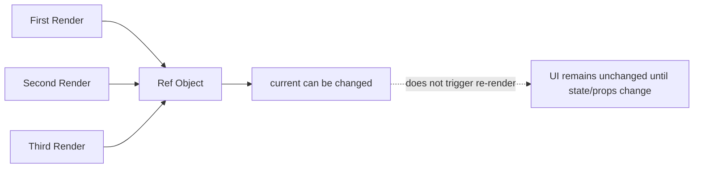

###### Topics

useRef: References and Persistence

- What is `useRef`?
- Using `useRef` for DOM references
- Setting focus on an input field

useRef in Practice

- Storing values without triggering re-renders
- Difference between `useRef` and State
- Common use cases for `useRef`

# 🧷 `useRef`: References and Persistence

`useRef` is a React hook that lets you create a **stable storage space across multiple renders**. This storage is an object with exactly one important property: `current`. React gives you the **same ref object** on every render, and this is the strength of `useRef`: The value persists without its updates automatically triggering a new render ([useRef – React](https://react.dev/reference/react/useRef)).

You can think of `useRef` as a little box that React keeps for your component. You can store something in this box, retrieve it later, and change it. Unlike state, React doesn’t say, “Oh, something changed here, I need to redraw the UI.” That’s why `useRef` is ideal for things that must be **remembered** but **don’t need to be displayed** directly.




<br><br><br>
## 🔍 What is `useRef`?

The basic idea of `useRef` is simple:

```jsx
import { useRef } from 'react';

function Example() {
  const myRef = useRef(0);

  return <button>Hello</button>;
}
```

`useRef(0)` creates an object roughly in this form:

```js
{
  current: 0
}
```

Importantly:

- The initial value you pass to `useRef(...)` is used only on the **first render**.
- After that, the ref object persists.
- When you change `myRef.current`, React does **not** re-render ([useRef – React](https://react.dev/reference/react/useRef)).

A simple example:

```jsx
import { useRef } from 'react';

function ClickCounterWithoutRender() {
  const countRef = useRef(0);

  function handleClick() {
    countRef.current += 1;
    console.log('Current value:', countRef.current);
  }

  return <button onClick={handleClick}>Click me</button>;
}
```

Here’s what happens: On each click, `countRef.current` increases. The new value appears in the console, but the component does not re-render. This clearly shows what `useRef` is for: **internal, mutable values** you want to keep between renders.

The most important takeaway:

**State is for values that affect the UI.  
Ref is for values you need to keep without re-rendering the UI.**

Another important point: `useRef` is often used for **DOM elements**, for example, an `<input>` you want to access. But it’s just as useful for normal JavaScript values, such as timer IDs, previous values, external instances, or other “remember this for me” data ([useRef – React](https://react.dev/reference/react/useRef)).

React also recommends not reading or writing to `ref.current` arbitrarily during rendering, because rendering in React should remain as pure and predictable as possible. Typical ref accesses happen instead in **event handlers** or **effects** ([useRef – React](https://react.dev/reference/react/useRef)).


<br><br><br>
## 🧱 Using `useRef` for DOM References

One of the most common uses for `useRef` is accessing actual DOM elements. For example, you might want to reference an `<input>`, `<div>`, or `<video>` element directly.

The basic pattern looks like this:

```jsx
import { useRef } from 'react';

function Form() {
  const inputRef = useRef(null);

  return <input ref={inputRef} type="text" />;
}
```

Here’s what happens behind the scenes:

1. You create a ref object with `useRef(null)`.
2. You pass this object to a DOM element via the `ref={inputRef}` attribute.
3. After the element is mounted in the DOM, React sets `inputRef.current` to the actual DOM node.
4. If the element is removed, React resets `inputRef.current` to `null` ([Manipulating the DOM with Refs – React](https://react.dev/learn/manipulating-the-dom-with-refs)).

This is especially useful when you want to do things that aren’t easy to solve declaratively through JSX alone, for example:

- setting focus
- scrolling
- selecting text
- measuring sizes
- controlling media
- connecting external libraries to DOM elements

A small example to try out:

```jsx
import { useRef } from 'react';

function Example() {
  const inputRef = useRef(null);

  function handleClick() {
    console.log(inputRef.current);
  }

  return (
    <>
      <input ref={inputRef} type="text" />
      <button onClick={handleClick}>Show DOM node</button>
    </>
  );
}
```

When you click the button, you see the real DOM element in the console. This is not a “React abstraction” but the actual underlying HTML element.

It’s also worth emphasizing: React generally wants you to describe UI **declaratively**. That means if something can be solved via state and props, you should prefer that. `useRef` for DOM access is right when you **need direct, targeted** access to a DOM element ([Manipulating the DOM with Refs – React](https://react.dev/learn/manipulating-the-dom-with-refs)).

In the React 19 context, it’s also good to know that for custom components, `ref` is available as a prop, making ref forwarding easier ([useImperativeHandle – React](https://react.dev/reference/react/useImperativeHandle)). For standard DOM elements like `<input>` or `<div>`, the basic principle remains as shown above.


<br><br><br>
## 🎯 Setting Focus on an Input Field

A very typical use case is focusing an input field. This is useful, for example, for search fields, login forms, or after clicking a button.

The basic example:

```jsx
import { useRef } from 'react';

function Search() {
  const inputRef = useRef(null);

  function handleFocus() {
    inputRef.current?.focus();
  }

  return (
    <>
      <input ref={inputRef} type="text" placeholder="Search..." />
      <button onClick={handleFocus}>Set focus</button>
    </>
  );
}
```

Here, `inputRef.current` is the actual DOM `input` element. You call the DOM `focus()` method on it. This sets keyboard focus to the element so the user can start typing immediately ([HTMLElement: focus() method – MDN Web Docs](https://developer.mozilla.org/en-US/docs/Web/API/HTMLElement/focus)).

The `?.` in `inputRef.current?.focus()` is a safety measure. It means: “Only call `focus()` if `current` is not `null`.” This makes sense, since a ref may be empty at times such as before the element is mounted or after it’s been removed.

If you want focus to be **set automatically on first render**, you combine `useRef` with `useEffect`:

```jsx
import { useEffect, useRef } from 'react';

function AutoFocus() {
  const inputRef = useRef(null);

  useEffect(() => {
    inputRef.current?.focus();
  }, []);

  return <input ref={inputRef} type="text" placeholder="Focused immediately" />;
}
```

Why is `useEffect` appropriate here? Because the effect runs **after rendering**. Only then does the DOM element reliably exist, and focus can be set. This is the recommended React pattern for DOM post-processing ([Manipulating the DOM with Refs – React](https://react.dev/learn/manipulating-the-dom-with-refs)).

Another practical example is focusing after validation:

```jsx
import { useRef, useState } from 'react';

function LoginForm() {
  const emailRef = useRef(null);
  const [email, setEmail] = useState('');

  function handleSubmit(e) {
    e.preventDefault();

    if (!email.trim()) {
      emailRef.current?.focus();
      return;
    }

    console.log('Submitting form');
  }

  return (
    <form onSubmit={handleSubmit}>
      <input
        ref={emailRef}
        type="email"
        value={email}
        onChange={(e) => setEmail(e.target.value)}
        placeholder="Email"
      />
      <button type="submit">Send</button>
    </form>
  );
}
```

This example clearly shows state and ref working together:

- The visible value of the input is held in state because it controls the UI.
- The reference to the DOM element is in a ref, as it’s intended for direct access.

This combination is very common in React.


<br><br><br>
# 🛠️ `useRef` in Practice

In practice, `useRef` is especially useful when you want to **persist a value within a component** without updating the UI every time it changes. This is a key capability, because not all information belongs in state.

When used properly, `useRef` makes your code cleaner, more efficient, and clearer: You draw a clear line between **visible state** and **internal helper values**.


<br><br><br>
## 💾 Storing Values Without Triggering Re-Render

Perhaps the main practical benefit of `useRef` is that you can store, change, and later reuse a value **without** React re-rendering because of it ([useRef – React](https://react.dev/reference/react/useRef)).

A classic example is a timer ID. Suppose you start a timer with `setInterval`. The return value from `setInterval` is needed later to stop the timer. However, this ID doesn’t need to be shown in the UI. That’s why a ref is better than state in this case.

```jsx
import { useRef, useState } from 'react';

function Stopwatch() {
  const intervalRef = useRef(null);
  const [seconds, setSeconds] = useState(0);

  function start() {
    if (intervalRef.current !== null) return;

    intervalRef.current = setInterval(() => {
      setSeconds((s) => s + 1);
    }, 1000);
  }

  function stop() {
    clearInterval(intervalRef.current);
    intervalRef.current = null;
  }

  return (
    <>
      <p>{seconds} seconds</p>
      <button onClick={start}>Start</button>
      <button onClick={stop}>Stop</button>
    </>
  );
}
```

Why is this useful?

- `seconds` goes in state because the value is shown in the UI.
- `intervalRef.current` goes in a ref because the timer ID is just an internal technical detail.

If you used state for the timer ID, you’d cause unnecessary re-renders, even though that value isn’t relevant to the UI.

Another example is storing **previous values** of a prop or state. This is useful when you want to compare changes:

```jsx
import { useEffect, useRef } from 'react';

function PriceDisplay({ price }) {
  const previousPriceRef = useRef(price);

  useEffect(() => {
    previousPriceRef.current = price;
  }, [price]);

  return (
    <p>
      Previous: {previousPriceRef.current} € <br />
      Now: {price} €
    </p>
  );
}
```

Here the ref remembers the last price value. On the next render, you can compare the current and previous values. This is a common scenario where `useRef` acts like an internal memory.

You can also store external instances in a ref, for example:

- a video instance
- a chart object
- an editor
- a map library
- an `AbortController`

You generally want to retain these objects across renders, but not cause a re-render every time something inside them changes. That’s another good use for `useRef` ([useRef – React](https://react.dev/reference/react/useRef)).

Crucially: Whenever a value changes and you want that change to be **visible**, `useRef` is the wrong tool. You need state for that. A ref is not a replacement for UI state, but a tool for **persistent, mutable helper values**.


<br><br><br>
## ⚖️ Difference Between `useRef` and State

Both `useRef` and state can “remember” values, but they serve very different purposes.

State is React’s official mechanism for data that affects a component’s output. When you change state, React schedules a new render to update the UI ([State: A Component's Memory – React](https://react.dev/learn/state-a-components-memory)).

A ref, on the other hand, is more like a private notepad for the component. You can change its content, but React doesn’t treat these changes as a reason to recalculate the UI ([useRef – React](https://react.dev/reference/react/useRef)).

The differences are clear in a table:

| Question | `useState` | `useRef` |
|---|---|---|
| Does the value persist across renders? | Yes | Yes |
| Does modifying the value trigger re-render? | Yes | No |
| Is the value meant for visible UI? | Yes | Usually no |
| Can I reference DOM elements? | No | Yes |
| Typical contents | Form values, active tabs, loading states | DOM nodes, timer IDs, previous values, external instances |
| Is the value “observed” by React for rendering? | Yes | No |

A very common mistake is trying to display something with `useRef`:

```jsx
import { useRef } from 'react';

function WrongExample() {
  const countRef = useRef(0);

  return (
    <>
      <p>Counter: {countRef.current}</p>
      <button onClick={() => countRef.current += 1}>+1</button>
    </>
  );
}
```

Many expect the displayed counter to go up on each click. But that doesn’t happen. The value in `countRef.current` really does change, but React doesn’t re-render, so the display doesn’t update—until an unrelated re-render happens by chance.

If you want the display to update, you must use state:

```jsx
import { useState } from 'react';

function CorrectExample() {
  const [count, setCount] = useState(0);

  return (
    <>
      <p>Counter: {count}</p>
      <button onClick={() => setCount(count + 1)}>+1</button>
    </>
  );
}
```

So your decision rule should be:

- **Should a change be immediately visible in JSX?** → `useState`
- **Should a value be remembered only internally?** → `useRef`

Often, you use both together. A realistic pattern looks like this:

- State for visible data
- Ref for technical details in the background

Example: In a search box, the current text is in state, but the input element itself is in a ref. This way, you cleanly control the UI via React while also having direct DOM access when you really need it.


<br><br><br>
## 🧰 Common Use Cases for `useRef`

`useRef` excels when you need to “remember something” that isn’t directly part of the visible React data logic. Major use cases include:

### 🖱️ Accessing DOM Elements

The classic scenario. You want to access an element in order to:

- set focus
- scroll
- select text
- measure size
- start or pause a video

That’s exactly what refs are for in React ([Manipulating the DOM with Refs – React](https://react.dev/learn/manipulating-the-dom-with-refs)).

```jsx
const inputRef = useRef(null);

<input ref={inputRef} />
```

Later, you can directly access the DOM element via `inputRef.current`.

<br><br><br>
### ⏱️ Timer IDs and Other Technical Helper Values

Values like `setInterval` or `setTimeout` IDs often need to be saved so you can cancel them later. These values are essential for your logic, but don’t belong in the visible UI—so refs are ideal.

The same applies to things like:

- `AbortController`
- WebSocket connections
- request IDs
- debounce/throttle helper values

All these should be **retained across renders** but not directly control the UI.

<br><br><br>
### 🔁 Remembering Previous Values

You often want to know: “What was the value on the last render?” `useRef` is an elegant solution for this.

```jsx
import { useEffect, useRef } from 'react';

function Status({ status }) {
  const prevStatusRef = useRef(status);

  useEffect(() => {
    prevStatusRef.current = status;
  }, [status]);

  return (
    <p>
      Previous status: {prevStatusRef.current} <br />
      Current status: {status}
    </p>
  );
}
```

This pattern is often used to log, animate, or compare changes.

<br><br><br>
### 🧩 Storing External Libraries or Instances

Many libraries are object-oriented and return an instance, such as:

- charts
- maps
- rich-text editors
- audio/video players
- canvas or WebGL objects

You usually don’t want to recreate these instances on every render. Instead, store them in a ref and access them when needed. This fits the purpose of `useRef` well because React doesn’t need to “observe” such instances for rendering ([useRef – React](https://react.dev/reference/react/useRef)).

<br><br><br>
### 🧠 Keeping the “Current” Value for Async Logic

Sometimes callbacks execute with a delay, for example in `setTimeout`, event listeners, or with WebSocket messages. In those cases, a closure may access outdated values. A ref can ensure you always have access to the latest value.

```jsx
import { useEffect, useRef, useState } from 'react';

function Example() {
  const [text, setText] = useState('');
  const currentTextRef = useRef(text);

  useEffect(() => {
    currentTextRef.current = text;
  }, [text]);

  function showLater() {
    setTimeout(() => {
      console.log('Current text:', currentTextRef.current);
    }, 2000);
  }

  return (
    <>
      <input value={text} onChange={(e) => setText(e.target.value)} />
      <button onClick={showLater}>Show in 2 seconds</button>
    </>
  );
}
```

Here, the ref ensures that the timeout callback always gets the most recently remembered value. This is an advanced but very practical use case.

<br><br><br>
### 🚫 What `useRef` Should NOT Be Used For

It’s just as important to know what `useRef` is **not** meant for.

You should not use `useRef` for:

- visible counters
- form states shown in the UI
- loading states
- error messages
- anything that should directly affect the UI

Such data belongs in state, so React reliably knows when to update the UI ([State: A Component's Memory – React](https://react.dev/learn/state-a-components-memory)).

The core difference isn’t technically complicated but conceptually very clear:

`useRef` is for **persistence without rendering impact**.  
State is for **visible, reactive data**.

Once you internalize this, `useRef` in React becomes very logical: It’s your tool for references, DOM access, and internal values that must persist between renders without being part of the visible state.